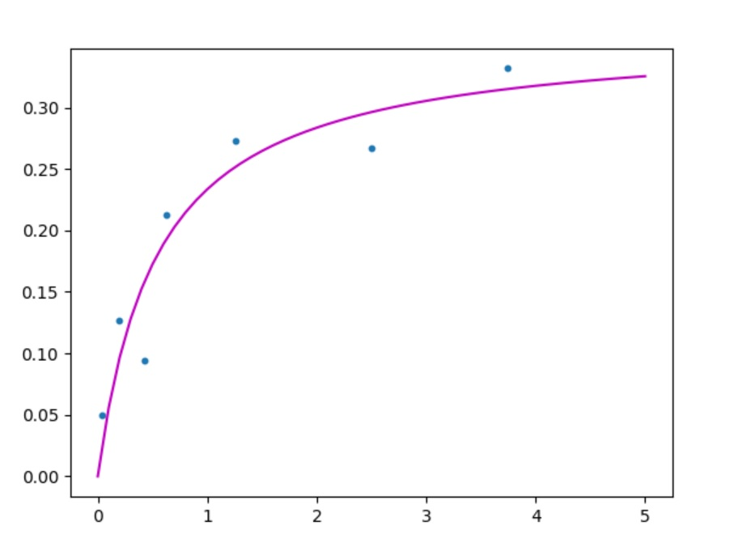

# Nonlinear Least Squares

Just playing around with Newton's method(to localalize local extrema of a given function, using it's second derivative information) and Gauss-Newton algorithm(to minimize a sum of squared function values).

More info:  
[Newton's Method](https://en.wikipedia.org/wiki/Newton%27s_method_in_optimization)  
[Gauss-Newton Algorithm](https://en.wikipedia.org/wiki/Gauss%E2%80%93Newton_algorithm)

## Dependencies

* C++  
* Eigen 3.4.0
* matplotlib-cpp

## Examples

Curve fitting using Gauss-Newton Algorithm
